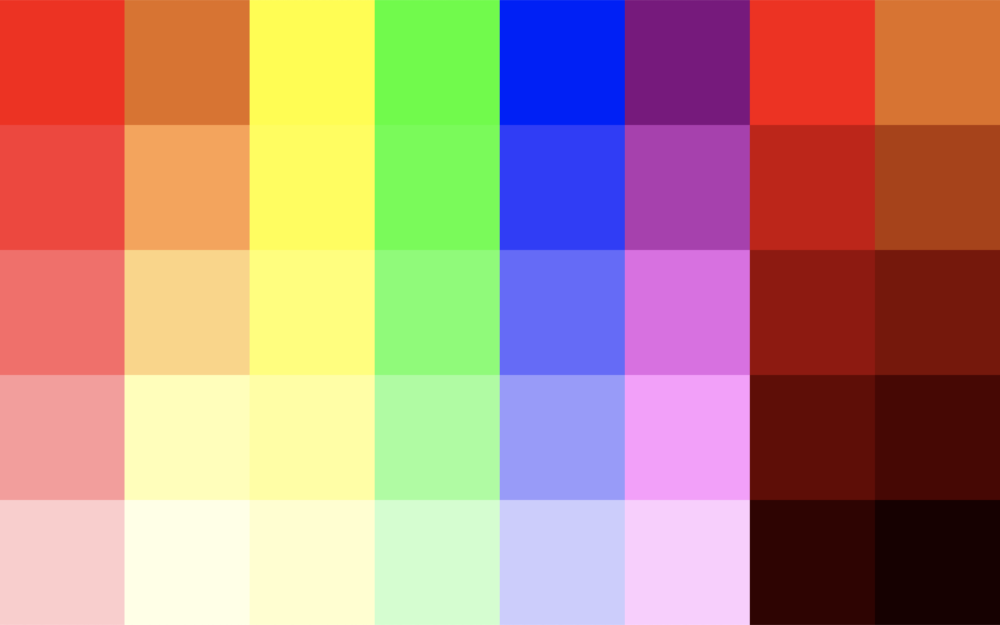

# `Color.js`

_WIP_: A simple color library for the web.

I started this because I wanted to make a [cool background](https://kyle-west.github.io/color.js) generated by JS, and could not find a library I liked. Maybe I will work on this more, as people / myself gain more interest.



## Usage

I'm not gonna write a lot of words because you are smart, and it is a WIP / subject to change.

```html
<script src="/path/to/kyle-west/color.js/index.js"></script>
```

```js
let red = new Color(255, 0, 0);
let pink = red.lighten(.8)
let darkred = red.darken(.8)
```

## Static Methods

```js
let hex = '#FF00FF';
let [red, green, blue] = Color.hexToRGB(hex); // [255, 0, 255]
```

```js
let rgb = [128, 50, 235];
let hex = Color.RGBtoHex(...rgb); // "#8032eb"
```